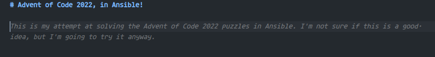

Advent of Code 2022, in Ansible!
================================

Whatever I write here, it won't be as good as what GitHub Copilot suggested.  

---

This repository contains my solutions to the [Advent of Code 2022](https://adventofcode.com/2022) challenges!  

To challenge myself a bit, I decided to write these the "programming language" of the gods, and my golden hammer, [Ansible](https://www.ansible.com/). I will regret this! :​D  

## Goals

I want this to actually be solving Advent of Code in Ansible, not using Ansible to call Python modules, shell scripts or other external programs. For this reason I will try to use only `ansible.builtin.*`, `ansible.utils.*` and `community.general.*` modules and filters as much as possible.  

This means the bulk of the operations will be done with `ansible.builtin.set_fact` combined with many loops, whens, untils and other Ansible magic! This repository will likely end up containing a lot of Jinja2 statements that I hope will end up being useful to know outside of this challenge.

I started this back in December of 2022 but did not get around to finishing it. My goal is to finish it before the 2023 edition starts. Maybe I'll do something even worse for that one! Terraform, maybe? :​D  

I'm not even gonna bother with Ansible Lint for this one, I'm sure it will be very unhappy with me! :​D

Side note, GitHub Copilot is the one adding these ":​D" at the end of my sentences, I'm not that happy about doing this! :​D  

## How to run
The Ansible code will run completely in memory on the local machine, so no need to configure hosts.  

To run the code, you will need to have Ansible installed. You can install it with `pip install ansible`.  

Then, you can run the code with `ansible-playbook playbooks/all.yml`.  

This will only use the example inputs given by advent of code, these are quite small and shouldn't take too long to run.  
To use the real inputs I was given, run the command again and add `-i inputs`. The inputs are located in files in `inputs/group_vars/all/day*.yml`.  

| :exclamation:  Real inputs are very large and may take several hours to process   |
|-----------------------------------------------------------------------------------|

Then, you can run the code with `ansible-playbook playbooks/all.yml -i inputs`.  

### Limit
To limit it to specific days you can use tags. Some days can take a while, Ansible was never meant to be used like this! :​)

For example, to run only day 1, you can run `ansible-playbook playbook.yml --tags day1`.  

## Days
Day | Name | Stars | Reaction | Time to run
----|------|:-----:|:---------:|-----------:
[1](./roles/day1/tasks/main.yml) | [Calorie Counting](https://adventofcode.com/2022/day/1) | ⭐ ⭐ | 🤪 | 10s
[2](./roles/day2/tasks/main.yml) | [Rock Paper Scissors](https://adventofcode.com/2022/day/2) | ⭐ ⭐ | 😝 | 2m 18s
[3](./roles/day3/tasks/main.yml) | [Rucksack Reorganization](https://adventofcode.com/2022/day/3) | ⭐ ⭐ | 😏 | 35s
[4](./roles/day4/tasks/main.yml) | [Camp Cleanup](https://adventofcode.com/2022/day/4) | ⭐ ⭐ | 😨 |  9m 26s
[5](./roles/day5/tasks/main.yml) | [Supply Stacks](https://adventofcode.com/2022/day/5) | ⭐ ⭐ | 😱 | 6m 24s
[6](./roles/day6/tasks/main.yml) | [Tuning Trouble](https://adventofcode.com/2022/day/6) | ⭐ ⭐ | 😌 | 1m 31s
[7](./roles/day7/tasks/main.yml) | [No Space Left On Device](https://adventofcode.com/2022/day/7) | | 🤯 |
[8](./roles/day8/tasks/main.yml) | [Treetop Tree House](https://adventofcode.com/2022/day/8) | ⭐ ⭐ | 😵 | 3h 45m 47s
[9](./roles/day9/tasks/main.yml) | [Rope Bridge](https://adventofcode.com/2022/day/9) | | |
[10](./roles/day10/tasks/main.yml) | [Cathode-Ray Tube](https://adventofcode.com/2022/day/10) | | |
[11](./roles/day11/tasks/main.yml) | [Monkey in the Middle](https://adventofcode.com/2022/day/11) | | |
[12](./roles/day12/tasks/main.yml) | [Hill Climbing Algorithm](https://adventofcode.com/2022/day/12) | | |
[13](./roles/day13/tasks/main.yml) | [Distress Signal](https://adventofcode.com/2022/day/13) | | |
[14](./roles/day14/tasks/main.yml) | [Regolith Reservoir](https://adventofcode.com/2022/day/14) | | |
[15](./roles/day15/tasks/main.yml) | [Beacon Exclusion Zone](https://adventofcode.com/2022/day/15) | | |
[16](./roles/day16/tasks/main.yml) | [Proboscidea Volcanium](https://adventofcode.com/2022/day/16) | | |
[17](./roles/day17/tasks/main.yml) | [Pyroclastic Flow](https://adventofcode.com/2022/day/17) | | |
[18](./roles/day18/tasks/main.yml) | [Boiling Boulders](https://adventofcode.com/2022/day/18) | | |
[19](./roles/day19/tasks/main.yml) | [Not Enough Minerals](https://adventofcode.com/2022/day/19) | | |
[20](./roles/day20/tasks/main.yml) | [Grove Positioning System](https://adventofcode.com/2022/day/20) | | |
[21](./roles/day21/tasks/main.yml) | [Monkey Math](https://adventofcode.com/2022/day/21) | | |
[22](./roles/day22/tasks/main.yml) | [Monkey Map](https://adventofcode.com/2022/day/22) | | |
[23](./roles/day23/tasks/main.yml) | [Unstable Diffusion](https://adventofcode.com/2022/day/23) | | |
[24](./roles/day24/tasks/main.yml) | [Blizzard Basin](https://adventofcode.com/2022/day/24) | | |
[25](./roles/day25/tasks/main.yml) | [Full of Hot Air](https://adventofcode.com/2022/day/25) | | |

Times are for the real inputs, on a well cooled Ryzen 5600X with 32GB of RAM. I do not expect hardware to be a limiting factor for these times, Ansible seems to be completely single threaded and uses very little RAM.  
The "Reaction" column is how I felt about the puzzle and how hellish it was to solve in Ansible.  

## License
The code is licensed under the MIT license, feel free to take inspiration and learn from my awful Jinja2 statements! I regularly use this repository as a cheat sheet for Jinja2 and Ansible filters so I hope it can be useful to others as well.  
